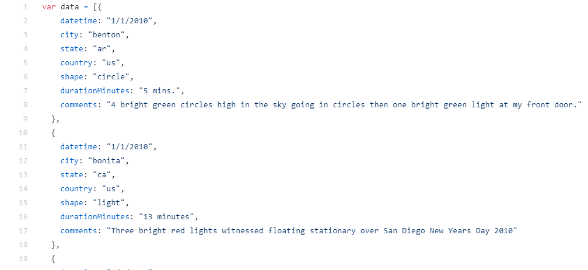
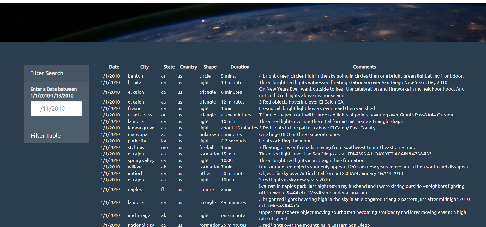

# javascript-challenge

This project outputs a data table and date search functionality on a basic HTML web page using javascript. 
The UFO dataset originally has the features of date/time, city, state, country, shape, duration and comment.  

  

The website visualizes the data in table format using javascript and bootstrap.  

  

The data table can also be updated to match user input for selected date/time. 
